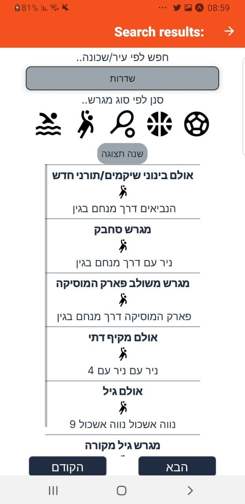

## Features-
##### -Find a close sports field(soccer field, basketball field, street workout place, etc) using your location.
##### -Look at your neighborhood's map and see every sports field near you.
##### -Display available details for a specific field- is it accessible, does it have lights, is there parking nearby, and more relevant details.
##### -Favourite you're beloved fields.
##### -Next up- leave posts & ratings for each field, use a calender to let users know when you're going, much better design.
## Technologies-
##### -React native
##### -State Managment using context with reducer --> a bit messy looking in this version.
##### -React-native-maps for the maps.
##### -Axios.
##### -Server on the making --> Express.js with MongoDB as DB. 

## Usage
##### npm install --> npm start

Entry Screen - 

Map List -

List -

Single Field -

